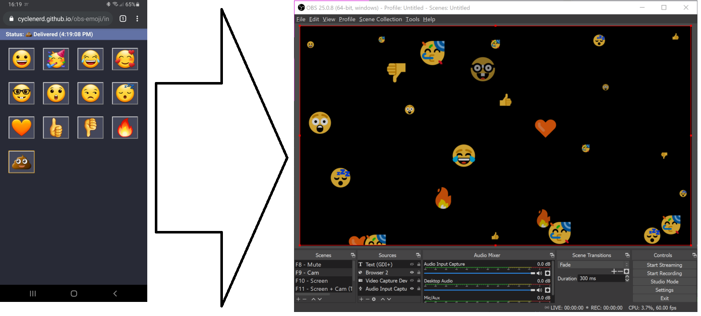
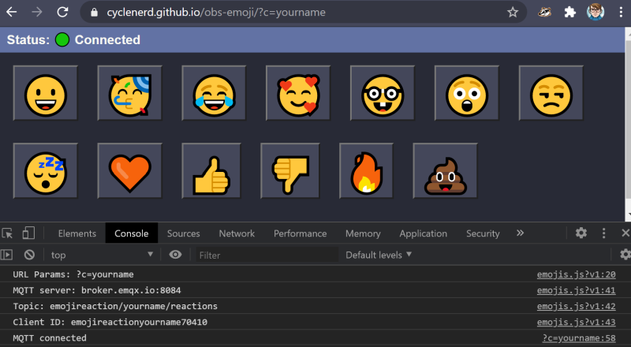
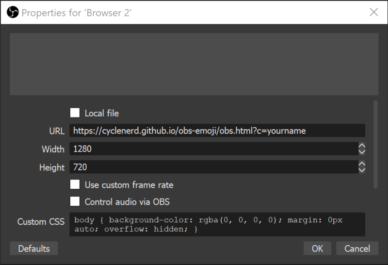
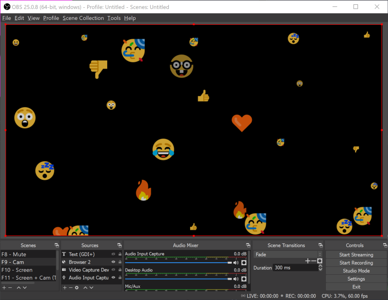

# Emoji Live Reaction for OBS



## Emoji

Send `https://cyclenerd.github.io/obs-emoji/index.html?c=YOURNAME` to your audience.
Replace `YOURNAME` with your unique name.
All emojis are sent and recieved with this name.



## OBS

Add URL `https://cyclenerd.github.io/obs-emoji/obs.html?c=YOURNAME` as Browser to OBS. Replace `YOURNAME` with the same name from the step before.



## Done

If someone clicks on an emoji it will be displayed in a few seconds.



## Self Hosted

Just clone this repo to your web server:

```
git clone "https://github.com/Cyclenerd/obs-emoji.git"
```

## More Emojis

Edit the file `emojis.js`. Add name and emoji to emojiNames.

Example:
```
wizard: '🧙',
```

## Enhancement

If you have cool ideas, e.g. how to create better animations, please feel free to fork this project.
Pull requests are welcome.

## License

GNU Public License version 3.
Please feel free to fork and modify this on GitHub <https://github.com/Cyclenerd/obs-emoji>.